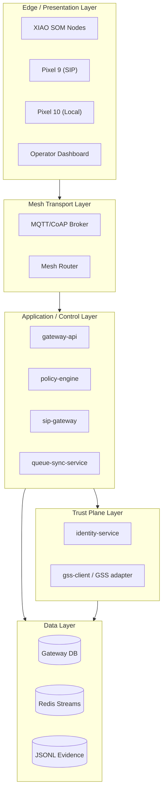
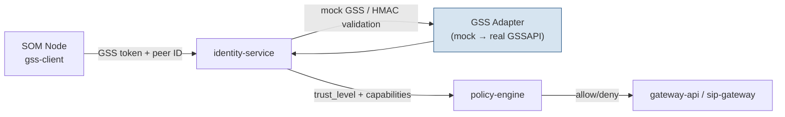
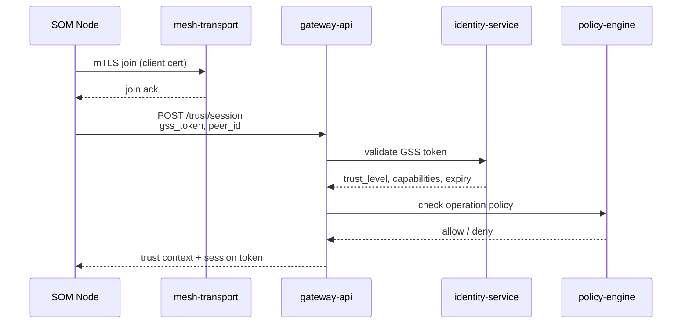
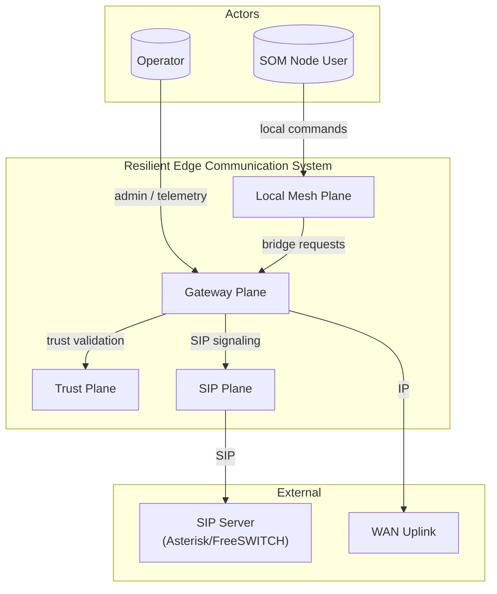
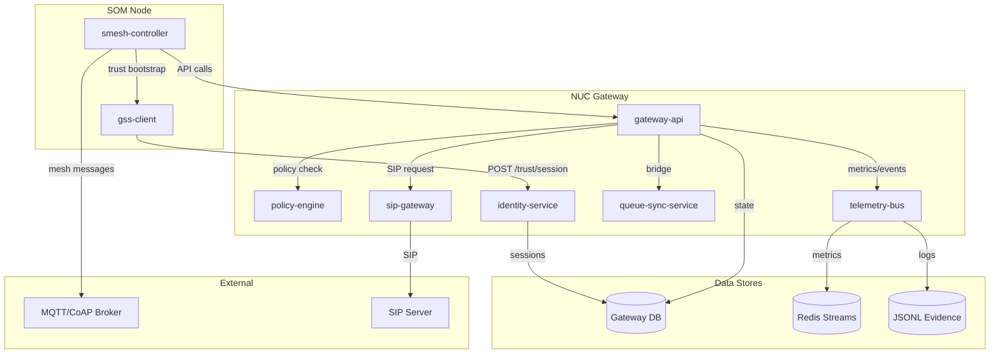
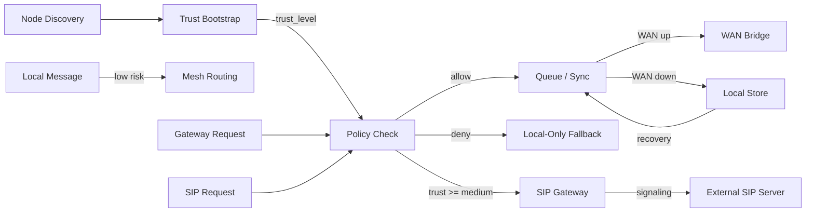
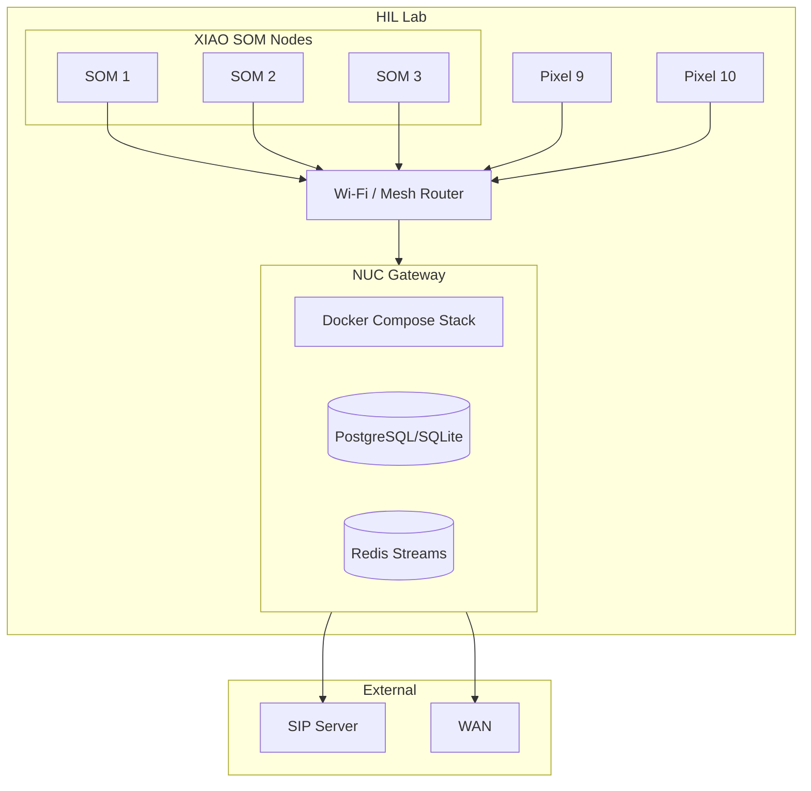

# Resilient Edge Communication System — Architecture Blueprint

**Version:** 1.0.0  
**Date:** 2026-07-15  
**Author:** nnos  
**Classification:** Internal Use

---

## 1. Executive Summary

This document defines the architecture for a resilient, local-first edge communication system. The system enables XIAO SOM nodes to form a self-healing local mesh, exchange authenticated messages without WAN connectivity, and opportunistically bridge to external SIP/session services through a NUC gateway when policy and trust allow.

Key architectural decisions:

1. **Local-first mesh:** SOM nodes discover and communicate peer-to-peer over local RF/Wi-Fi; no WAN dependency for core control-plane messaging.
2. **Four-plane separation:** Mesh Plane, Trust Plane, Gateway Plane, and SIP Plane are isolated by responsibility and policy gates.
3. **Promotion-gated trust:** Elevated operations (gateway bridge, SIP session) require a successful GSS trust bootstrap yielding `trust_level >= medium`.
4. **Queue-and-replay resilience:** Events and commands are persisted locally during WAN/gateway outages and reconciled on recovery.
5. **Gateway as policy enforcer:** The NUC gateway owns WAN bridging, SIP routing, and centralized telemetry; it does not weaken local-only security.
6. **Mock-to-real trust evolution:** The trust plane ships with a mock GSS/HMAC implementation for HIL validation, with a pluggable adapter for real GSSAPI / Apple GSS.framework.
7. **Observability by default:** Every plane emits structured telemetry to a lightweight bus for health, queue depth, and traceability.

Target deployment: lab/HIL environment with 3+ SOM nodes, one NUC gateway, and two Pixel devices for end-to-end validation.

---

## 2. Business Context

### 2.1 Business Objectives

- Build a sovereign edge communication substrate that does not require carrier or cloud connectivity for local coordination.
- Validate trust-gated bridging between local mesh and external SIP/session infrastructure.
- Produce a reusable trust-plane module and gateway API that can be promoted into broader community-care applications (e.g., IHEP aftercare resource routing).

### 2.2 Primary Stakeholders

| Stakeholder | Role |
|-------------|------|
| Operator (nnos) | System owner, provenance gatekeeper, HIL tester |
| Edge-device users | SOM-node operators and local-app consumers |
| Community-care integrators | Future consumers of the trust-plane / promotion-gated patterns |

### 2.3 Success Criteria

- Two or more SOM nodes exchange authenticated local messages without WAN.
- Same nodes optionally route sessions through the SIP gateway when WAN and trust policy permit.
- Pixel 9 runs signed SIP test cases end-to-end.
- Pixel 10 validates local discovery, control UX, and diagnostics in local-only mode.
- WAN loss and recovery preserve queued state and resume sync without manual intervention.
- Failed trust bootstrap results in safe local-only fallback.

### 2.4 Scope

**In scope:**
- XIAO SOM mesh discovery, heartbeat, and local messaging.
- GSS-based trust bootstrap (mock + adapter contract for real GSS).
- NUC gateway API, policy engine, and telemetry bus.
- SIP bridge policy gate and integration contract.
- Local queue/replay and gateway reconciliation.

**Out of scope (residuals):**
- Real Apple GSS.framework adapter implementation.
- NASN firmware join wire-up.
- Production carrier provisioning.
- Cloud backend beyond the local NUC gateway.

---

## 3. System Overview

### 3.1 Purpose and Value Proposition

The system provides a resilient communication layer for edge devices. It prioritizes local autonomy: devices can discover each other, authenticate, and exchange control messages even when upstream connectivity is unavailable. When connectivity and trust policy allow, the system bridges selected traffic to external SIP/session infrastructure.

### 3.2 High-Level Capabilities

- Automatic peer discovery and mesh formation.
- Mutual authentication and capability advertisement via GSS trust contexts.
- Local command/control messaging with integrity and replay protection.
- Policy-gated WAN/SIP bridging through a NUC gateway.
- Local persistence and automatic reconciliation after outages.
- Real-time telemetry and health diagnostics.

### 3.3 User Types and Access Modes

| User / Actor | Access Mode | Trust Requirement |
|--------------|-------------|-------------------|
| SOM node | Embedded agent, mesh participant | Bootstrap-derived identity |
| NUC gateway | Privileged bridge, policy enforcer | Pre-provisioned gateway credential |
| Pixel 9 | SIP endpoint, full-flow validator | `trust_level >= medium` + carrier SIP allow |
| Pixel 10 | Local-only endpoint, diagnostics viewer | Bootstrap-derived identity or local guest |
| Operator | Admin dashboard, HIL scripts | Operator credential (out-of-band) |

### 3.4 Integration Landscape

External integrations are optional and policy-gated:

- **SIP server / IMS core** (Asterisk or FreeSWITCH) for external session signaling.
- **WAN uplink** for gateway backend reachability.
- **Operator dashboard** for telemetry and diagnostics.

---

## 4. Architecture Principles

1. **Local-first autonomy.** Core control-plane messaging must work without WAN, cloud, or carrier services.
2. **Security by design.** Identity, authentication, integrity, and replay protection are mandatory for control commands.
3. **Trust-level gating.** High-risk operations (gateway bridge, SIP) require an explicit trust context at or above the configured threshold.
4. **Fail-safe degradation.** Trust or gateway failures reduce the node to local-only mode rather than opening insecure fallback paths.
5. **Observability by default.** Every plane emits structured events and metrics for health, audit, and debugging.
6. **Subsystem isolation.** The trust plane and SIP plane are bounded subsystems with well-defined integration contracts.
7. **Promotion-gated changes.** Objects and policies move from sandbox to production through explicit promotion, mirroring the broader project governance model.
8. **Mock-to-real evolution.** Components define concrete adapter contracts so mock implementations can be swapped for production integrations.

---

## 5. Architecture Layers

| Layer | Responsibility | Key Components |
|-------|---------------|----------------|
| **Edge / Presentation** | SOM firmware, phone apps, operator dashboard | `smesh-controller`, Pixel validation apps, Grafana dashboards |
| **Mesh Transport** | Local discovery, heartbeat, message routing | MQTT/CoAP broker, mesh routing table, mTLS transport |
| **Application / Control** | Business logic, policy enforcement, bridging | `gateway-api`, `policy-engine`, `sip-gateway`, `queue-sync-service` |
| **Trust Plane** | Identity bootstrap, capability advertisement | `identity-service`, `gss-client`, GSS adapter |
| **Data** | Persistence, queues, telemetry store | SQLite/PostgreSQL, Redis Streams, JSONL evidence logs |
| **Infrastructure** | Compute, networking, containers | Docker Compose on NUC, embedded runtime on SOM, Wi-Fi/mesh RF |



---

## 6. Component Architecture

### 6.1 Component Inventory

| ID | Component | Layer | Responsibility |
|----|-----------|-------|----------------|
| C01 | `smesh-controller` | Edge | SOM firmware service for discovery, heartbeat, local messaging |
| C02 | `mesh-transport` | Mesh | MQTT/CoAP broker and mesh routing fabric |
| C03 | `gateway-api` | Application | Central gateway REST/gRPC API for bridge requests |
| C04 | `policy-engine` | Application | Evaluates trust level, device policy, and routing permissions |
| C05 | `queue-sync-service` | Application | Local queue persistence and reconciliation on recovery |
| C06 | `sip-gateway` | Application | SIP bridge policy gate and signaling proxy |
| C07 | `identity-service` | Trust Plane | GSS context negotiation, trust-level assignment, capability advertisement |
| C08 | `gss-client` | Trust Plane | SOM-side trust bootstrap client (mock + real adapter contract) |
| C09 | `telemetry-bus` | Data | In-process event collection and forwarding |
| C10 | `gateway-store` | Data | Gateway persistence (PostgreSQL/SQLite) |
| C11 | `redis-streams` | Data | Async event queue and transient state |
| C12 | `evidence-logger` | Data | Append-only JSONL logs for audit and HIL evidence |

### 6.2 Component Details

#### C01 — `smesh-controller`

- **Responsibility:** Runs on each XIAO SOM node. Discovers peers, maintains heartbeat, sends/receives local messages, and enforces local-only fallback when trust or gateway is unavailable.
- **Inputs:** Peer beacons, mesh messages, operator commands, trust-context updates.
- **Outputs:** Heartbeats, routed messages, telemetry events, queue state.
- **Dependencies:** `mesh-transport`, `gss-client`, local storage.
- **Technology:** Python or C++/MicroPython depending on SOM capability.
- **Scaling:** Horizontal by adding SOM nodes; no central state.

#### C02 — `mesh-transport`

- **Responsibility:** Provides local discovery and message routing between SOM nodes and the gateway.
- **Inputs:** MQTT/CoAP messages, peer discovery broadcasts.
- **Outputs:** Routed messages to subscribers, link-health events.
- **Dependencies:** Wi-Fi/mesh RF driver, mTLS certificates.
- **Technology:** Mosquitto MQTT or Eclipse Californium CoAP over mTLS.
- **Scaling:** Gateway broker scales vertically; mesh routing is distributed.

#### C03 — `gateway-api`

- **Responsibility:** Exposes authenticated REST/gRPC endpoints for mesh join, messaging, trust session, SIP session, and gateway sync.
- **Inputs:** HTTP/gRPC requests from SOM nodes and phones.
- **Outputs:** API responses, routed commands, policy decisions to downstream services.
- **Dependencies:** `policy-engine`, `identity-service`, `queue-sync-service`, `sip-gateway`.
- **Technology:** Python/FastAPI or Go.
- **Scaling:** Stateless; horizontal replicas behind a load balancer if needed.

#### C04 — `policy-engine`

- **Responsibility:** Decides whether a requested operation is permitted based on trust level, device policy, and gateway health.
- **Inputs:** Request context, `trust_level`, device ID, operation type.
- **Outputs:** Allow/deny decision with reason code.
- **Dependencies:** `gateway-store` for policy rules.
- **Technology:** Python rule engine or Open Policy Agent (OPA).
- **Scaling:** Stateless; embedded in `gateway-api` or sidecar.

#### C05 — `queue-sync-service`

- **Responsibility:** Persists outbound events locally during gateway loss and replays them on recovery.
- **Inputs:** Events to forward, gateway health status.
- **Outputs:** Acknowledged events, replay batches, queue-depth metrics.
- **Dependencies:** Local SQLite/JSONL on SOM; Redis Streams on gateway.
- **Technology:** Python with SQLite or Redis Streams.
- **Scaling:** Per-node queue; gateway reconciles per-device streams.

#### C06 — `sip-gateway`

- **Responsibility:** Proxies SIP session requests from trusted nodes to the external SIP server, enforcing policy gates.
- **Inputs:** `/sip/session` requests with trust context.
- **Outputs:** SIP signaling responses, session state.
- **Dependencies:** Asterisk/FreeSWITCH, `policy-engine`.
- **Technology:** Python FastAPI + pjsip or Asterisk ARI.
- **Scaling:** Single gateway instance in lab; can be clustered with shared SIP registrar.

#### C07 — `identity-service`

- **Responsibility:** Server-side trust bootstrap, GSS context negotiation, trust-level derivation, and capability advertisement.
- **Inputs:** `gss_token`, `gss_context_id`, `gss_peer_id`, `gss_expiry_unix`.
- **Outputs:** `trust_level`, capability list, session token.
- **Dependencies:** GSS adapter (mock or real), `gateway-store`.
- **Technology:** Python module (`gss-trust-plane/src/gss_trust_plane/identity.py`).
- **Scaling:** Stateless; can be replicated.

#### C08 — `gss-client`

- **Responsibility:** SOM-side client that initiates GSS bootstrap and caches trust context.
- **Inputs:** Peer identity, gateway endpoint.
- **Outputs:** GSS token, context ID, expiry, trust level.
- **Dependencies:** `identity-service`, GSS adapter.
- **Technology:** Python mock client with adapter contract.
- **Scaling:** One client per SOM node.

### 6.3 Trust Plane Subsystem

The Trust Plane is a specialized subsystem with strict isolation from the mesh and gateway planes. It owns identity bootstrap and capability advertisement.



**Subsystem boundaries:**
- Internal: GSS adapter, identity store, trust-level derivation.
- External interfaces: `POST /trust/session`, capability advertisement events.
- Scaling: Stateless; real GSS operations are CPU-bound but rare (bootstrap only).

---

## 7. Technology Stack

| Category | Technology | Version / Notes | Purpose |
|----------|-----------|-----------------|---------|
| Edge Runtime | Python / MicroPython / C++ | TBD per SOM capability | SOM control logic |
| Mesh Transport | MQTT (Mosquitto) or CoAP (Californium) | Latest stable | Local discovery and messaging |
| Transport Security | mTLS / TLS 1.3 | X.509 per node | Confidentiality and integrity on mesh |
| Gateway API | Python / FastAPI | Latest stable | REST/gRPC gateway services |
| Policy Engine | Open Policy Agent (OPA) or Python rule engine | Latest stable | Trust-level and device policy decisions |
| Trust Plane | `gss-trust-plane` module + GSS adapter | Current mock, real adapter backlog | Identity bootstrap |
| SIP Bridge | Asterisk or FreeSWITCH + ARI | LTS | External session signaling |
| Gateway Database | PostgreSQL (prod) / SQLite (lab) | 15+ / 3.x | Persistent policy and state |
| Queue / Stream | Redis Streams | 7.x | Async event queue and transient state |
| Local Queue | SQLite or JSONL | Embedded | Per-SOM outage persistence |
| Telemetry | Prometheus + Grafana | Latest stable | Metrics and dashboards |
| Logging | Structured JSONL | Append-only | Audit and HIL evidence |
| Container Runtime | Docker + Docker Compose | Latest stable | NUC service deployment |
| CI/CD | GitHub Actions | Repository-native | Build, test, seal |

### Rationale

- **FastAPI** was chosen for rapid iteration, strong async support, and automatic OpenAPI documentation.
- **MQTT/CoAP** are proven local-IoT protocols with low overhead and existing embedded libraries.
- **PostgreSQL/SQLite split** lets the lab run on SQLite while production can scale to PostgreSQL without code changes.
- **Redis Streams** provides durable, ordered event streams for gateway reconciliation.
- **Prometheus/Grafana** are lightweight enough for a NUC and provide operator visibility.

---

## 8. Data Architecture

### 8.1 Key Entities

| Entity | Purpose | Stored By |
|--------|---------|-----------|
| Node | SOM device identity, public key, capabilities | `gateway-store` |
| TrustSession | GSS context, trust level, expiry | `gateway-store` + SOM local cache |
| PolicyRule | Device-type and trust-level permissions | `gateway-store` |
| MeshMessage | Routed local message with signature | `evidence-logger` |
| QueuedEvent | Outbound event buffered during outage | Local SOM store + Redis Streams |
| SipSession | SIP bridge session state | `gateway-store` |
| TelemetrySample | Health/metric sample | Prometheus / JSONL |

### 8.2 Database Selection

- **Gateway state:** PostgreSQL in production for ACID policy and session state; SQLite acceptable for lab/HIL.
- **Local SOM state:** SQLite or JSONL for queue and trust cache.
- **Telemetry:** Prometheus TSDB for metrics; JSONL evidence logs for audit.

### 8.3 Data Flow

1. SOM node discovers peers and heartbeat flows through `mesh-transport`.
2. `gss-client` initiates trust bootstrap; `identity-service` validates and returns `trust_level`.
3. Local messages are routed mesh-only.
4. Gateway-bound events pass through `policy-engine`; allowed events enter `queue-sync-service`.
5. During WAN loss, events are persisted locally; on recovery, `queue-sync-service` replays.
6. SIP requests require `trust_level >= medium`; `sip-gateway` proxies to Asterisk/FreeSWITCH.
7. Telemetry samples flow to `telemetry-bus` → Prometheus + JSONL evidence log.

### 8.4 Retention and Encryption

- **Retention:**
  - Trust sessions: until expiry + 7 days.
  - Mesh messages: 30 days in evidence log.
  - Telemetry: 15 days Prometheus, 90 days JSONL archive.
  - Queued events: deleted after successful acknowledgement.
- **Encryption:**
  - At-rest: AES-256 for gateway DB backups; local SQLite encrypted with SQLCipher where available.
  - In-transit: TLS 1.3 / mTLS for all mesh and gateway traffic.

---

## 9. Integration Architecture

### 9.1 Integration Inventory

| Integration | Protocol | Purpose | Auth Method |
|-------------|----------|---------|-------------|
| SOM ↔ SOM | MQTT/CoAP over mTLS | Local mesh messaging | X.509 client certs |
| SOM ↔ NUC | HTTPS/gRPC over LAN | Gateway bridge requests | Mutual TLS + trust token |
| NUC ↔ SIP Server | SIP / ARI | External session signaling | SIP digest + TLS |
| NUC ↔ Phones | HTTPS / LAN APIs | Control UX and diagnostics | Trust token or local guest |
| NUC ↔ Operator | HTTPS / Grafana | Dashboard and alerts | Operator credentials |

### 9.2 API Contract

| Endpoint | Method | Purpose | Trust Gate |
|----------|--------|---------|------------|
| `/mesh/join` | POST | Register node with mesh | Low / bootstrap |
| `/mesh/message` | POST | Send local mesh message | Low + signature |
| `/mesh/health` | GET | Query mesh and node health | Low |
| `/trust/session` | POST | Establish GSS trust context | Bootstrap |
| `/sip/session` | POST | Request SIP bridge session | `trust_level >= medium` |
| `/gateway/sync` | POST | Replay queued events | Medium |

### 9.3 Error Handling and Retry

- Mesh messages: exponential backoff up to 5 seconds; link repair target < 5 seconds.
- Gateway requests: retry with jitter on transient failures; queue on persistent failure.
- SIP requests: fail open to local-only mode; never retry unauthorized requests.
- Trust bootstrap: limited retries (3) before local-only fallback.

### 9.4 Rate Limiting

- Per-node message rate limiting on `mesh-transport`.
- Per-device SIP session creation limits to prevent toll fraud.
- Gateway API rate limits enforced at reverse proxy or API gateway.

---

## 10. Security Architecture

### 10.1 Authentication Flow

1. Each SOM node holds an X.509 certificate issued at provisioning.
2. On join, the node presents its certificate to `mesh-transport` and `gateway-api`.
3. The node calls `/trust/session` with a GSS token.
4. `identity-service` validates the token via the GSS adapter and issues a trust context.
5. Subsequent high-risk requests include the trust context; `policy-engine` validates it.



### 10.2 Authorization Model

- **RBAC by device type:** SOM node, gateway, phone, operator.
- **ABAC by trust level:** `low` = local mesh only; `medium` = gateway sync + SIP; `high` = admin operations.
- **Policy rules** are versioned and promoted from sandbox to house/production registry.

### 10.3 Encryption

- **In-transit:** TLS 1.3 for all HTTP/gRPC/SIP; mTLS for mesh transport.
- **At-rest:** AES-256 for gateway database backups; SQLCipher for local SQLite where feasible.
- **Secrets:** Stored in environment-specific config or hardware-backed keystore; never committed.

### 10.4 Compliance Mapping

| Requirement | Standard / Control | Implementation |
|-------------|-------------------|----------------|
| Identity verification | NIST 800-63A | X.509 + GSS trust bootstrap |
| Integrity protection | NIST 800-53 SC-8 | mTLS + signed control commands |
| Replay protection | NIST 800-53 SC-23 | Nonce + expiry in command signatures |
| Audit logging | NIST 800-53 AU-6 | Append-only JSONL evidence logs |
| Fail-safe | IEC 62443 | Local-only fallback on trust failure |

---

## 11. Deployment Architecture

### 11.1 Environment Topology

| Environment | Purpose | Infrastructure |
|-------------|---------|----------------|
| Sandbox | Local development, unit tests | Docker Compose on developer machine |
| HIL Lab | Hardware-in-the-loop validation | NUC + 3+ SOM nodes + Pixel devices |
| House/Production | Operator-controlled deployment | NUC gateway at edge site |

### 11.2 Container Strategy

NUC services run as Docker Compose stack:

```yaml
services:
  gateway-api:
  policy-engine:
  identity-service:
  sip-gateway:
  queue-sync-service:
  mesh-broker:
  gateway-db:
  redis:
  prometheus:
  grafana:
```

SOM nodes run embedded firmware with containerization where supported.

### 11.3 CI/CD Pipeline

1. **Lint and unit test** (`pytest`, `cargo test`, etc.).
2. **Integration tests** in Docker Compose sandbox.
3. **HIL evidence collection** (`python3 gss-trust-plane/scripts/run_hil.py`).
4. **Integrity manifest generation** (`integrity-manifest/scripts/generate_hashes.py`).
5. **Promotion gate:** sandbox → HIL → house.
6. **Provenance seal** (`provenance-archive/scripts/seal_provenance.py`).

### 11.4 Deployment Strategy

- **NUC:** Blue/green container restart with health checks.
- **SOM firmware:** OTA or USB flashing with rollback on boot failure.
- **Policy/rules:** Promotion-gated registry updates, not direct edits in production.

---

## 12. Scalability & Performance

### 12.1 Expected Load

- **SOM nodes:** 3–50 per gateway in lab; production target 100+.
- **Local control messages:** < 500ms median latency under normal RF.
- **Mesh path repair:** < 5 seconds.
- **Gateway failover to local-only:** < 15 seconds.
- **Trust bootstrap:** < 2.0s median under normal local RF.

### 12.2 Scaling Strategy

- **Gateway API:** Stateless horizontal scaling behind a LAN load balancer.
- **Mesh transport:** Distributed routing; broker scales vertically or shards by topic prefix.
- **Trust plane:** GSS bootstrap is infrequent; single instance sufficient for lab.
- **Queue service:** Per-device streams in Redis; shard by device ID if needed.

### 12.3 Caching

- Trust contexts cached on SOM nodes until expiry.
- Policy rules cached in `gateway-api` with TTL and registry-version invalidation.
- Mesh routing tables maintained in-memory with periodic reconciliation.

### 12.4 Database Optimization

- Indexed columns: `node_id`, `trust_session.expiry`, `policy_rule.version`.
- Read replicas for telemetry queries if Prometheus is not sufficient.
- Partitioned evidence logs by date.

---

## 13. Observability & Monitoring

### 13.1 Logging Strategy

- Structured JSON logs from all services.
- Correlation IDs propagated across mesh and gateway requests.
- Evidence logs are append-only JSONL for audit and HIL validation.

### 13.2 Metrics Catalog

| Metric | Source | Alert Threshold |
|--------|--------|-----------------|
| `mesh_node_count` | `mesh-transport` | < expected node count |
| `mesh_message_latency_ms` | `smesh-controller` | p99 > 500ms |
| `trust_bootstrap_duration_ms` | `identity-service` | p99 > 2000ms |
| `trust_bootstrap_failures` | `identity-service` | > 3 in 5 min |
| `gateway_reachability` | `queue-sync-service` | 0 for > 15s |
| `queue_depth` | `queue-sync-service` | > 1000 per node |
| `sip_session_count` | `sip-gateway` | anomaly |
| `policy_denials` | `policy-engine` | spike |

### 13.3 Alerting and Escalation

- PagerDuty or local webhook for gateway-down and trust-plane failures.
- Dashboard alerts for queue depth and mesh partition.
- HIL evidence reports generated per test run.

### 13.4 Dashboards

- Mesh topology and link health.
- Trust bootstrap success/failure rates.
- Gateway bridge and SIP session state.
- Queue depth and reconciliation lag.

---

## 14. Disaster Recovery & Backup

### 14.1 Objectives

- **RPO:** 1 minute for gateway state; zero for locally queued events (stored on device).
- **RTO:** 5 minutes for NUC gateway service restart; 15 minutes for full NUC rebuild.

### 14.2 Backup Schedule

| Data | Frequency | Retention | Method |
|------|-----------|-----------|--------|
| Gateway DB | Hourly | 7 days | pg_dump / SQLite copy |
| Policy registry | On change | 30 versions | Git + signed manifest |
| Evidence logs | Continuous | 90 days | Append-only JSONL + rsync |
| SOM firmware | On release | All releases | Versioned binaries in object store |

### 14.3 Failover Strategy

- **Gateway loss:** SOM nodes automatically enter local-only mode and queue events.
- **Gateway recovery:** `queue-sync-service` replays queued events in order.
- **NUC rebuild:** Restore DB from backup, re-deploy Docker Compose, re-enroll node certificates if needed.

### 14.4 Replication

- Gateway DB: asynchronous streaming replica to a standby NUC if dual-gateway deployment is used.
- Redis Streams: AOF persistence enabled for recovery.

---

## 15. Risk Assessment

| Risk | Likelihood | Impact | Mitigation |
|------|-----------|--------|------------|
| Carrier policy blocks SIP/IMS | High | Medium | Maintain local-first path; parallel SIP only when allowed |
| RF instability partitions mesh | Medium | Medium | Mesh path repair < 5s; redundant links where possible |
| NUC gateway single point of failure | Medium | High | Local-only fallback; standby replica; queue-and-replay |
| GSS interoperability gaps | Medium | High | Strict token contract; mock→real adapter; conformance tests |
| Trust bootstrap replay attack | Low | High | Nonce + expiry in tokens; short-lived contexts |
| Firmware update bricks SOM node | Low | Medium | Rollback bootloader; staged rollout |
| Operator misconfigures policy | Medium | Medium | Promotion gate; versioned rules; audit log |

---

## 16. Implementation Roadmap

### 16.1 Phase Breakdown

| Phase | Deliverables | Timeline | Dependencies |
|-------|-------------|----------|--------------|
| **Phase 1: Local Mesh Baseline** | SOM discovery, heartbeat, local messaging; `smesh-controller`; `mesh-transport` sandbox tests | Weeks 1–2 | SOM hardware, Wi-Fi/mesh RF |
| **Phase 2: Trust Plane Integration** | `identity-service` + `gss-client`; mock GSS HIL; policy-engine gates | Weeks 3–4 | Phase 1, GSS adapter contract |
| **Phase 3: Gateway & Resilience** | `gateway-api`, `queue-sync-service`, WAN failover, queue/replay | Weeks 5–6 | Phase 2, NUC deployment |
| **Phase 4: SIP Bridge** | `sip-gateway`, Asterisk/FreeSWITCH integration, Pixel 9 validation | Weeks 7–8 | Phase 3, SIP server |
| **Phase 5: Observability & Hardening** | Prometheus/Grafana, evidence logging, DR runbook, production hardening | Weeks 9–10 | Phases 1–4 |

### 16.2 Critical Path

1. Mesh transport must be stable before trust-plane integration.
2. Trust plane must be validated in HIL before SIP bridge is enabled.
3. Queue/replay must be implemented before WAN failover testing.
4. Policy promotion gate must be operational before any production deployment.

### 16.3 Resource Requirements

- 3+ XIAO SOM nodes
- 1 NUC gateway
- 1 Pixel 9 (unlocked/rooted)
- 1 Pixel 10 (carrier-locked)
- Wi-Fi/mesh RF lab environment
- Asterisk or FreeSWITCH SIP server

---

## 17. Appendices

### 17.1 Glossary

| Term | Definition |
|------|------------|
| SOM | System-on-Module; small embedded compute board (e.g., XIAO) |
| NUC | Next Unit of Computing; small-form-factor Intel PC used as gateway |
| GSS | Generic Security Services; API for authentication (GSSAPI/Kerberos) |
| SIP | Session Initiation Protocol; signaling for VoIP and IMS sessions |
| HIL | Hardware-in-the-Loop; testing with real devices |
| RAARA | Research, Analyze, Assess, Report, HIL — project governance cycle |
| IHEP | Community aftercare application referenced in project roadmap |

### 17.2 Acronyms and Abbreviations

- **IMS:** IP Multimedia Subsystem
- **mTLS:** Mutual Transport Layer Security
- **OPA:** Open Policy Agent
- **OTA:** Over-the-Air
- **RPO:** Recovery Point Objective
- **RTO:** Recovery Time Objective
- **TLS:** Transport Layer Security

### 17.3 Reference Documents

- `requirements.md` — functional and non-functional requirements
- `design-spec.md` — design specifications and workstreams
- `technical-spec.md` — technical stack and API contracts
- `PROJECT_SUMMARY.md` — project status and residual gaps
- `TODO.md` — cycle status and next priorities

### 17.4 Diagram Key

- **Teal:** Edge / Presentation layer
- **Orange:** Application / Control layer
- **Green:** Data layer
- **Purple:** Infrastructure layer
- **Gray:** External systems
- **Steel blue:** Data flow arrows
- **Dashed dark red:** Subsystem boundary

### 17.5 Version History

| Version | Date | Author | Changes |
|---------|------|--------|---------|
| 1.0.0 | 2026-07-15 | nnos | Initial architecture blueprint |

---

## 18. Architecture Diagrams

### Figure 1: System Context Diagram



### Figure 2: Container / Component Diagram



### Figure 3: Layered Architecture Diagram

(See Section 5 architecture-layers diagram.)

### Figure 4: Data Flow Diagram



### Figure 5: Deployment Diagram



### Figure 6: Security / Auth Flow Diagram

(See Section 11 sequence diagram.)

### Figure 7: Trust Plane Subsystem Diagram

(See Section 6.3 subsystem diagram.)
